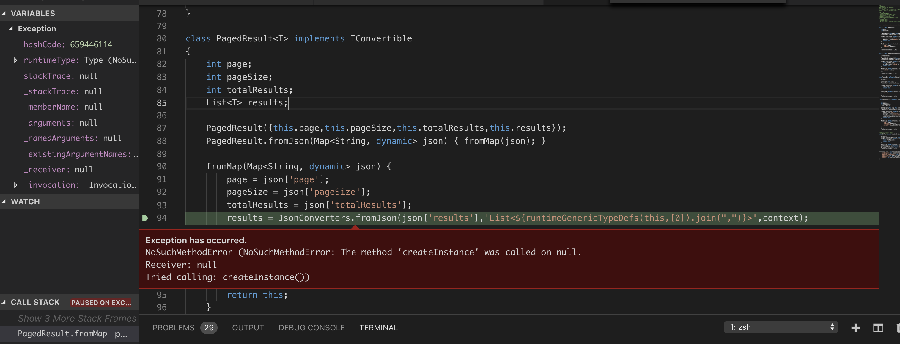

# dart-ref-repo
Servicestack Service implementation to reproduce issue with `dart-ref`.

generated service reference: [foos.dtos.dart](foos.dtos.dart)


Using `JsonServiceClient` to get data from backend:

```dart
  var response = await _client.get(new GetFoos());
```

Results in this exception:


The call to createInstance() is in [json_converters.dart](https://github.com/ServiceStack/servicestack-dart/blob/master/lib/json_converters.dart#L257) where typeInfo is null.
